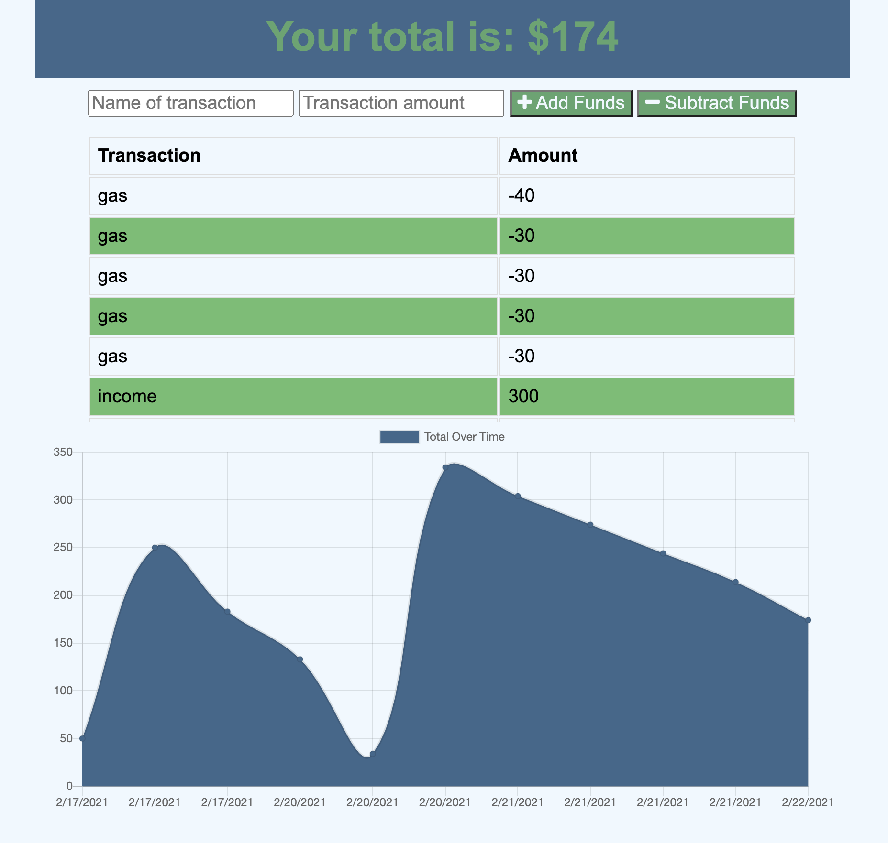

# my2Cents

    
## Table of Contents
==================
* [Description](#Description)
* [Technologies](#Technologies)
* [Installation](#Installation)
* [Usage](#Usage) 
* [license](#license) 
* [Questions](#Questions)

==================
    
## Description
My 2 cents is a progressive web app budget tracker. you can save the app to your home page and use off or online to track your expenses.
    
## Technologies

App was coded with Javascript using an expresss server. 

## Installation
    
no installation needed. go to site using URL here: https://my2centsmoneytracker.herokuapp.com/ If you would like to save to device while in chrome, click on share button, click add to home screen.
    
## Usage

Website can be used in the browser or can be saved by adding to home screen as an app. Then can track your expenses offline and will be updated when you go back online. Enter in title of expenses amount and if its a withdraw or deposit. The Chart will visual show your balance.
### license

This application is covered under the MIT License. Please see any additional files in GitHub for details. 

### Questions

If you have any questions please contact at [beccaablanton@gmail.com](beccaablanton@gmail.com)

[Link to GitHub Profile](https://www.github.com/BeccaBlanton)

### Example

[Link to Deployed Site](https://my2centsmoneytracker.herokuapp.com/)